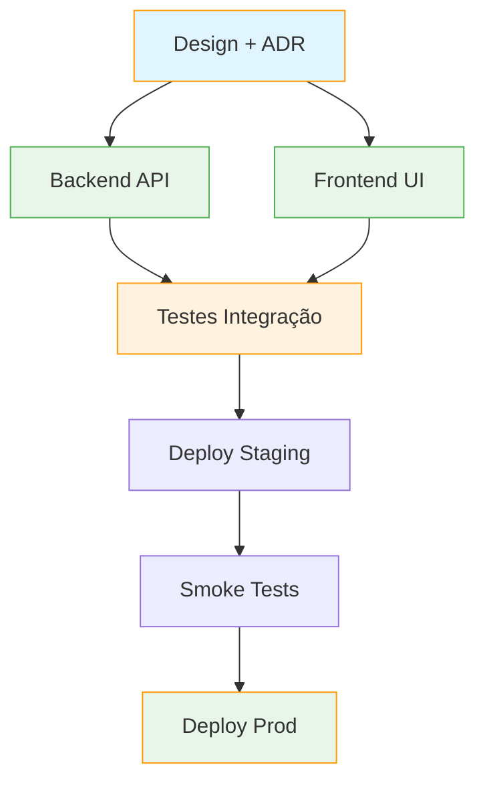

# 📋 Task Decomposition — Decomposição Inteligente de Tarefas

> **Objetivo**: Transformar objetivos vagos/complexos em **planos executáveis, verificáveis e paralelos** — com dependências explícitas, checkpoints, rollback points e critérios de aceite.

---

## 🎯 Princípios Fundamentais

| Princípio | Descrição |
|-----------|-----------|
| **Atomicidade** | Cada subtask é indivisível — ou completa ou não; sem "quase pronto" |
| **Dependência Explícita** | Grafo DAG — sem ciclos, order topológico garantido |
| **Verificabilidade** | Cada subtask tem critério de aceite objetivo (pass/fail) |
| **Paralelismo Max** | Tasks independentes rodam simultâneo; sync apenas em join points |
| **Checkpoint/Rollback** | Stato persistido a cada marco; rollback atômico se falha |
| **Estimativa Calibrada** | Esforço em "ideal hours" + buffer de incerteza (evidence-based) |

---

## 🧱 Estrutura do Plano (TaskPlan)

```python
@dataclass
class SubTask:
    id: str                          # UUID único
    name: str                        # Legível: "Configurar pool Redis"
    description: str                 # Detalhado + contexto
    acceptance_criteria: List[str]   # ["Pool criado", "Health check OK", "Latência < 5ms"]
    dependencies: List[str]          # IDs de tasks que devem completar antes
    estimated_effort: float          # Horas ideais (ex: 0.5, 2.0, 8.0)
    uncertainty: float               # 0.0-1.0 (buffer = effort * uncertainty)
    parallel_group: str | None       # Tasks no mesmo grupo rodam paralelas
    checkpoint: bool                 # Se True: persistir estado após conclusão
    rollback_on_failure: bool        # Se True: rollback automático se falhar
    skills_required: List[str]       # Skills necessárias para executar
    tools_required: List[str]        # Tools necessárias
    tags: List[str]                  # ["infra", "redis", "performance"]

@dataclass
class TaskPlan:
    goal: str                        # Objetivo alto nível
    tasks: List[SubTask]             # Lista topologicamente ordenada
    parallel_groups: Dict[str, List[str]]  # group_id -> [task_ids]
    critical_path: List[str]         # IDs no caminho crítico
    total_estimated_effort: float    # Soma effort + buffers
    risk_assessment: RiskAssessment  # Riscos identificados + mitigações
    checkpoints: List[Checkpoint]    # Pontos de persistência de estado
```

---

## 🔄 Pipeline de Decomposição (4 Estágios)

```
┌─────────────────────────────────────────────────────────────────────────────┐
│                        TASK DECOMPOSITION PIPELINE                          │
├─────────────────────┬─────────────────────┬─────────────────┬───────────────┤
│   1. UNDERSTAND     │   2. BREAKDOWN      │   3. STRUCTURE  │  4. VALIDATE  │
│   (análise objetivo)│   (subtasks atômicas)│ (DAG + parallel)│  (critérios)  │
├─────────────────────┼─────────────────────┼─────────────────┼───────────────┤
│ • Parse goal        │ • Identify subgoals │ • Build DAG     │ • Check cycles │
│ • Identify constraints│ • Atomic check    │ • Topo sort     │ • Critical path│
│ • Identify risks    │ • Estimate effort   │ • Parallel groups│ • Resource fit │
│ • Context gather    │ • Uncertainty calib │ • Checkpoints   │ • Acceptance OK│
└─────────────────────┴─────────────────────┴─────────────────┴───────────────┘
```

---

## 🎯 Estágio 1: UNDERSTAND (Análise do Objetivo)

**Entrada**: Goal em linguagem natural + contexto opcional

**Saída**: `GoalAnalysis` estruturado

```python
@dataclass
class GoalAnalysis:
    core_objective: str              # Objetivo central (1 frase)
    success_metrics: List[str]       # Como sabermos que acabou
    constraints: List[Constraint]    # Tempo, orçamento, recursos, compliance
    assumptions: List[str]           # Premissas explícitas
    stakeholders: List[str]          # Quem impacta/decide
    context: Dict[str, Any]          # Estado atual, sistemas envolvidos
    risk_factors: List[RiskFactor]   # Riscos conhecidos
```

**Técnicas**:
- **5 Whys** para chegar à causa raiz
- **SMART Check**: Specific, Measurable, Achievable, Relevant, Time-bound
- **Premortem**: "Se falhar daqui 6 meses, por quê?"

---

## ✂️ Estágio 2: BREAKDOWN (Subtasks Atômicas)

**Regra de Ouro**: Uma subtask é atômica se **não pode ser dividida sem perder verificabilidade**.

**Teste de Atomicidade**:
```
❌ "Configurar banco de dados"        → Muito vago
✅ "Criar schema users no PostgreSQL" → Atômico (critério: \dt users existe)
✅ "Criar índice email em users"      → Atômico (critério: \di users_email_idx)

❌ "Otimizar API"                     → Vago
✅ "Adicionar cache Redis no endpoint /users" → Atômico
✅ "Configurar TTL 300s no cache"     → Atômico
```

**Técnicas de Breakdown**:
1. **Hierarchical Decomposition**: Goal → Epics → Stories → Tasks
2. **Workflow Decomposition**: Input → Process → Output → Validation
3. **Component Decomposition**: System → Subsystems → Modules → Functions
2. **Temporal Decomposition**: Phase 1 → Phase 2 → Phase 3 (sequencial)

---

## 🕸️ Estágio 3: STRUCTURE (DAG + Paralelismo)

**Construção do Grafo**:
```
Task A (setup infra) ──┬──▶ Task B (deploy app) ──▶ Task D (smoke test)
                       │
                       └──▶ Task C (config monitor) ──▶ Task D
```

**Algoritmo**:
1. Build adjacency list from dependencies
2. Detect cycles (Kahn's algorithm) → erro se ciclo
3. Topological sort → execution order
3. Identify parallel groups: tasks com mesmo `level` no DAG e sem deps entre si
4. Critical path: longest path by effort
5. Assign checkpoints: após cada parallel group join + tasks critical_path

**Paralelismo Seguro**:
- Tasks no mesmo `parallel_group` executam simultâneo
- Sync barrier: `wait_for(group_id)` antes de prosseguir
- Resource limits: `max_parallel_per_group` configuraível

---

## ✅ Estágio 4: VALIDATE (Critérios de Aceite)

**Checklist de Validação**:
- [ ] **DAG válido**: Sem ciclos, topo sort possível
- [ ] **Critérios SMART**: Cada task tem acceptance criteria específico, mensurável
- [ ] **Cobertura**: Todas as success_metrics do goal cobertas por tasks
- [ ] **Recursos**: Skills/tools necessários disponíveis
- [ ] **Esforço realista**: Total effort dentro do budget + buffer
- [ ] **Riscos mapeados**: Cada risk_factor tem mitigation task
- [ ] **Checkpoints**: Estado persistido antes de pontos de não-retorno
- [ ] **Rollback points**: Tasks irreversíveis têm rollback plan

---

## 🛡️ Risk Assessment (Integrado)

```python
@dataclass
class RiskFactor:
    id: str
    description: str
    probability: float      # 0.0-1.0
    impact: float           # 0.0-1.0 (blast radius)
    risk_score: float       # probability * impact
    mitigation_task_id: str # Task que mitiga este risco
    contingency: str        # Plano B se mitigação falhar

@dataclass
class RiskAssessment:
    factors: List[RiskFactor]
    overall_risk: float     # Média ponderada
    high_risk_count: int    # Factors com score > 0.6
    mitigation_coverage: float # % risks com mitigation task
```

---

## 🔄 Execução com Checkpoints & Rollback

```
┌────────────────────────────────────────────────────────────────────┐
│                    EXECUTION ENGINE                                │
├────────────────────────────────────────────────────────────────────┤
│                                                                    │
│  CHECKPOINT 1 (infra ready)                                        │
│  ├▶ Task A (infra) ────────────────────────────────────────────┐  │
│  │                                                              │  │
│  ├▶ Task B (deploy) ┬▶ Task C (monitor) ───▶ CHECKPOINT 2 ┘   │  │
│  │                   │                                          │  │
│  └──────────────────▶ Task D (test) ──────────────────────────┘  │
│                                                                    │
│  ON FAILURE:                                                       │
│  • Rollback to last checkpoint                                     │
│  • Execute compensating transactions (reverse order)              │
│  • Notify + log failure context                                    │
└────────────────────────────────────────────────────────────────────┘
```

**Compensating Transactions** (para rollback):
```python
@dataclass
class CompensatingAction:
    original_task_id: str
    action_type: str              # "delete" | "revert" | "disable" | "custom"
    target: str                   # Recurso alvo
    payload: Dict[str, Any]       # Parâmetros da ação reversa
    verified: bool                # Confirmou reversão?
```

---

## 🎯 Templates de Decomposição (Reutilizáveis)

### Template: Feature Development
```yaml
goal: "Implementar feature X"
tasks:
  - id: design
    name: "Design técnico + ADR"
    deps: []
    effort: 2.0
    checkpoint: true
  
  - id: backend
    name: "API + lógica de negócio"
    deps: [design]
    effort: 8.0
    parallel_group: impl
  
  - id: frontend
    name: "UI + integração"
    deps: [design]
    effort: 6.0
    parallel_group: impl
  
  - id: tests
    name: "Testes unitários + integração"
    deps: [backend, frontend]
    effort: 4.0
    checkpoint: true
  
  - id: deploy
    name: "Deploy staging + smoke test"
    deps: [tests]
    effort: 1.0
    checkpoint: true
```

### Template: Incident Response
```yaml
goal: "Resolver incidente P0: API 500 errors"
tasks:
  - id: triage
    name: "Triage + isolar escopo"
    deps: []
    effort: 0.5
    checkpoint: true
  
  - id: root_cause
    name: "Análise causa raiz (logs, traces)"
    deps: [triage]
    effort: 1.0
  
  - id: fix
    name: "Implementar fix mínimo"
    deps: [root_cause]
    effort: 2.0
    checkpoint: true
  
  - id: verify
    name: "Verificar fix + monitorar 30min"
    deps: [fix]
    effort: 0.5
    checkpoint: true
  
  - id: postmortem
    name: "Escrever postmortem + action items"
    deps: [verify]
    effort: 1.0
```

### Template: Refactoring/Migration
```yaml
goal: "Migrar de Redis v5 para v7"
tasks:
  - id: audit
    name: "Auditar usage patterns + breaking changes"
    deps: []
    effort: 2.0
  
  - id: staging
    name: "Setup staging com Redis v7"
    deps: [audit]
    effort: 1.0
    parallel_group: prep
  
  - id: compat
    name: "Testes compatibilidade client libs"
    deps: [audit]
    effort: 3.0
    parallel_group: prep
  
  - id: migrate_staging
    name: "Migração staging + smoke tests"
    deps: [staging, compat]
    effort: 1.0
    checkpoint: true
  
  - id: canary
    name: "Canary 5% produção + monitor 1h"
    deps: [migrate_staging]
    effort: 1.0
  
  - id: full
    name: "Migração 100% + rollback plan"
    deps: [canary]
    effort: 2.0
    checkpoint: true
```

---

## 🛠️ API / Funções Exportadas

```python
# Decompor goal em plano
plan = decompose_task(
    goal: str,
    context: Dict[str, Any] = {},
    constraints: List[Constraint] = [],
    templates: List[str] = [],           # Usar templates conhecidos
    max_parallelism: int = 4,
    effort_calibration: CalibrationData  # Histórico para calibrar estimativas
) -> TaskPlan

# Validar plano existente
validation = validate_plan(plan: TaskPlan) -> ValidationReport

# Otimizar plano (reordenar para paralelismo max)
optimized_plan = optimize_plan(
    plan: TaskPlan,
    max_parallelism: int,
    resource_constraints: ResourceConstraints
) -> TaskPlan

# Executar plano com checkpoints/rollback
execution = execute_plan(
    plan: TaskPlan,
    executor: TaskExecutor,
    checkpoint_store: CheckpointStore,
    on_task_complete: Callable[[SubTask, TaskResult], None],
    on_checkpoint: Callable[[Checkpoint], None],
    on_failure: Callable[[SubTask, Exception], RecoveryAction]
) -> ExecutionResult

# Gerar plano a partir de template
plan = plan_from_template(
    template_name: str,
    parameters: Dict[str, Any],
    context: Dict[str, Any]
) -> TaskPlan

# Visualizar plano (Mermaid/Graphviz)
diagram = render_plan_diagram(
    plan: TaskPlan,
    format: str = "mermaid"  # "mermaid" | "graphviz" | "ascii"
) -> str
```

---

## 📊 Diagramas de Visualização (Mermaid)



---

## 🔧 Integração com Outras Skills

| Skill | Integração |
|-------|------------|
| **Thinking Frameworks** | First Principles para breakdown; Inversion para identificar riscos; 80/20 para priorizar tasks |
| **Metacognition** | Monitora qualidade da decomposição; detecta over/under-decomposition |
| **Capability Evolver** | Patterns de decomposition failure → melhorias no template |
| **Task Pilot** | TaskPlan vira input do Task Pilot (context anchors, verification) |
| **TaskOps** | TaskPlan vira execution graph no TaskOps |
| **Systematic Debugging** | Bug fix vira incident template → decomposition automática |
| **Capability Evolver** | Patterns de decomposition failure geram template improvements |

---

## 📊 Métricas de Qualidade de Decomposição

| Métrica | Descrição | Target |
|---------|-----------|--------|
| **Atomicity Score** | % tasks que passam teste de atomicidade | 100% |
| **Parallel Efficiency** | Speedup real / speedup teórico (Amdahl) | > 70% |
| **Estimation Accuracy** | Actual effort / estimated effort | 0.8 - 1.2 |
| **Checkpoint Coverage** | % critical path tasks com checkpoint | 100% |
| **Rollback Success Rate** | Rollbacks bem-sucedidos / tentativas | 100% |
| **Rework Rate** | Tasks refeitas por decomposição insuficiente | < 10% |

---

## 📝 Exemplo de Uso Prático

```python
# Decompor objetivo complexo
plan = decompose_task(
    goal="Migrar monólito para microserviços (auth, payments, notifications)",
    context={
        "current_stack": "Django monolith, PostgreSQL, Redis",
        "team_size": 4,
        "timeline_weeks": 12
    },
    constraints=[
        Constraint(type="budget", max_effort_hours=400),
        Constraint(type="downtime", max_minutes=5),
        Constraint(type="compliance", requirements=["PCI-DSS", "LGPD"])
    ],
    templates=["microservice_migration", "database_decomposition"],
    max_parallelism=3
)

# plan contém:
# - 27 subtasks organizadas em 6 parallel groups
# - Critical path: 142h (com buffer)
# - Total effort: 387h (com buffers)
# - 12 checkpoints, 8 rollback points
# - Risk assessment: 7 risks, 6 com mitigation

# Visualizar
print(render_plan_diagram(plan, "mermaid"))

# Validar
validation = validate_plan(plan)
# validation.ok = True
# validation.warnings = ["Task 'data_migration' effort high uncertainty (0.8)"]

# Executar
execution = execute_plan(
    plan=plan,
    executor=MyTaskExecutor(),
    checkpoint_store=RedisCheckpointStore(),
    on_failure=auto_rollback_and_notify
)
```

---

## 📁 Templates Built-in (Extensíveis)

```
templates/
├── feature_development.yaml
├── incident_response.yaml
├── refactoring_migration.yaml
├── microservice_migration.yaml
├── database_decomposition.yaml
├── api_development.yaml
├── infrastructure_provisioning.yaml
├── security_audit.yaml
├── performance_optimization.yaml
├── data_migration.yaml
├── incident_response.yaml
└── custom/              # User-defined templates
```

---

## 📜 Licença

MIT — Parte do projeto Damon Evolution (github.com/eapeli/damon)